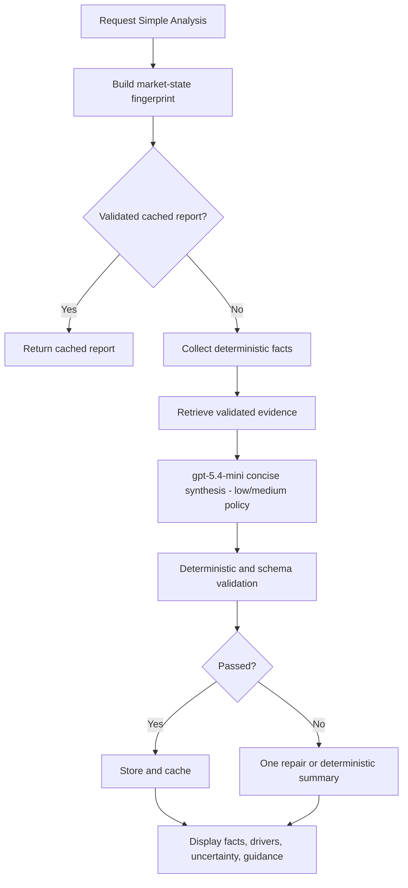
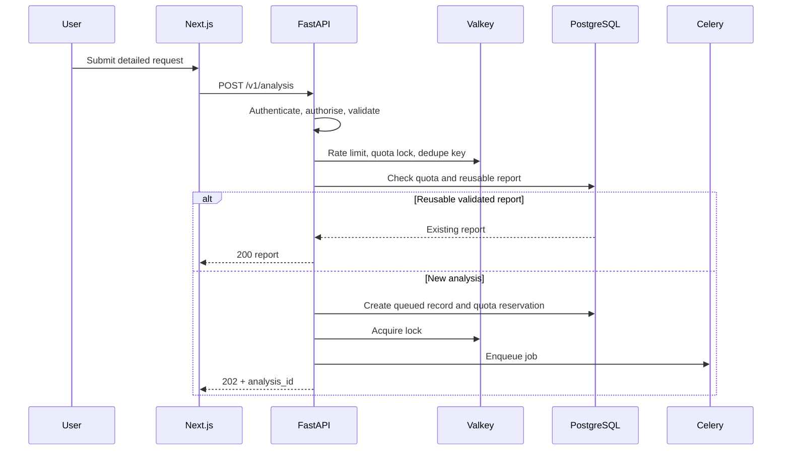
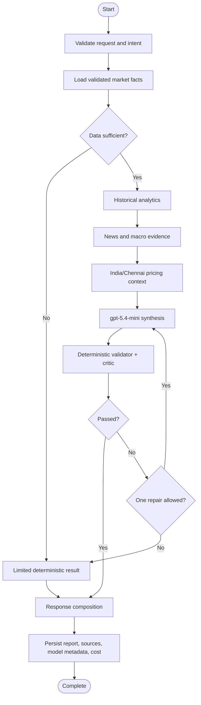

# AurumIQ — Application Flow Specification

**Document ID:** GMAA-FLOW-001  
**Version:** 1.2 Claude Code + Agent-Skills Enforced  
**Date:** 2026-08-05  
**Status:** Approved for implementation  
**Canonical format:** Markdown  
**Related documents:** `Gold_Market_AI_Agent_PRD.md`, `Gold_Market_AI_Agent_TRD.md`, `Gold_Market_AI_Agent_UI_UX_Recommendations.md`  
**Supersedes:** Version 1.1 Agent-Skills Enforced dated 2026-08-05  

---

## Revision Summary

The approved OpenAI `gpt-5.4-mini`, LangGraph, deterministic-tool, asynchronous-processing, caching, quota, validation, and fallback flows remain unchanged. This revision keeps Addy Osmani's `addyosmani/agent-skills` workflow mandatory and selects Claude Code as the implementation environment for every happy path, failure path, and recovery path. Exact, fully namespaced skill invocation and verification evidence are required.

## Approval Record

| Item | Decision | Approved baseline |
|---|---|---|
| UI/UX recommendations | Approved for implementation | Facts-first layout, progressive disclosure, safe trace, quota UX, degraded states, WCAG 2.2 AA, responsive P0 journeys |
| Application flow | Approved for implementation | Deterministic-first processing, asynchronous detailed analysis, deduplication, quota reservation, bounded repair, fallback, trace propagation |
| Runtime model | Approved | OpenAI `gpt-5.4-mini` through the Responses API for every runtime agent node |
| Development workflow | Approved | Claude Code with Addy Osmani `addyosmani/agent-skills`; each flow slice follows mandatory planning, build, test, failure, security, observability, and review skills |

Approval does not authorise personalised investment advice, guaranteed price direction, unlicensed data redistribution, hidden chain-of-thought exposure, or silent model escalation.

---

## Addy Osmani Agent-Skills Workflow Mandate (Normative)

In these controlled documents, **`agent-skills` means only the production engineering workflow pack published at `addyosmani/agent-skills`**. It does not mean AurumIQ's runtime LangGraph market-analysis agents, and it must not be replaced by a generic project-local skill summary.

Authoritative source and Claude Code integration:

- Repository: `https://github.com/addyosmani/agent-skills`
- Development environment: Claude Code CLI and its supported IDE integration
- Marketplace installation inside Claude Code:

  ```text
  /plugin marketplace add addyosmani/agent-skills
  /plugin install agent-skills@addy-agent-skills
  ```

- HTTPS fallback when GitHub SSH cloning is unavailable:

  ```text
  /plugin marketplace add https://github.com/addyosmani/agent-skills.git
  /plugin install agent-skills@addy-agent-skills
  ```

- Meta-skill invoked at the start of work: `/agent-skills:using-agent-skills`
- Task-specific skill invocation: `/agent-skills:<skill-name>`
- Lifecycle command wrappers, when used: `/agent-skills:spec`, `/agent-skills:plan`, `/agent-skills:build`, `/agent-skills:test`, `/agent-skills:review`, `/agent-skills:webperf`, `/agent-skills:code-simplify`, and `/agent-skills:ship`
- Skill definitions: the actual `skills/<skill-name>/SKILL.md` files installed from the authoritative repository

At repository bootstrap, the team must record the installed repository commit SHA in an `agent-skills.lock` file. Upgrades require human review, a documented change record, and revalidation of affected gates.

### Claude Code execution requirements

1. Start Claude Code from the AurumIQ repository root so the root `CLAUDE.md`, project settings, and repository context are applied consistently.
2. Keep the root `CLAUDE.md` concise. It must point Claude Code to these seven controlled documents, define their precedence, require the namespaced Addy Osmani skills, list approved build/test commands, and prohibit silent edits to controlled specifications. Do not copy Addy Osmani's repository-level `CLAUDE.md` or paste complete upstream `SKILL.md` bodies into the project `CLAUDE.md`.
3. Use fully namespaced commands such as `/agent-skills:using-agent-skills` and `/agent-skills:test-driven-development`. This prevents accidental use of similarly named Claude Code bundled skills or skills from another plugin.
4. After installation or upgrade, verify the plugin is enabled through `/plugin`, confirm the commands are visible through `/help`, invoke `/agent-skills:using-agent-skills`, and record the observed plugin version or commit SHA.
5. Claude Code may automatically select an applicable installed skill, but explicit invocation remains mandatory at controlled task boundaries and must be recorded as evidence.
6. Claude Code is the development assistant only. AurumIQ runtime agents continue to use OpenAI `gpt-5.4-mini` through the Responses API.

### Mandatory operating rules

1. Begin every implementation, design, migration, test, review, or release task by invoking `/agent-skills:using-agent-skills`.
2. Let the meta-skill route the task to the applicable Addy Osmani skill or skills. If a skill has even a plausible match, load and follow the actual `SKILL.md` workflow before proceeding.
3. Do not implement directly when an applicable skill exists. Complete its required specification, planning, verification, review, and exit gates.
4. Use `/agent-skills:git-workflow-and-versioning` for every code change and `/agent-skills:code-review-and-quality` before every merge.
5. Invoke `/agent-skills:debugging-and-error-recovery` immediately when tests, builds, migrations, runtime behaviour, or external integrations fail. Do not bypass or weaken a failing gate to continue.
6. Record evidence in the work item or pull request: task ID, installed agent-skills commit SHA, skills invoked, completed checkpoints, tests/commands run, results, unresolved risks, and approved exceptions.
7. A task is not complete when skill invocation or verification evidence is missing. Any exception requires explicit human approval and an ADR or controlled change record.

### Application-flow skill routing

| Flow activity | Mandatory Addy Osmani skills |
|---|---|
| Decomposing a journey or state machine into work | `/agent-skills:planning-and-task-breakdown` |
| Implementing a vertical flow slice | `/agent-skills:incremental-implementation`, `/agent-skills:test-driven-development` |
| API, event, idempotency, asynchronous status, or provider boundary | `/agent-skills:api-and-interface-design` |
| Authentication, authorisation, quota, admin, trace privacy, or sensitive state | `/agent-skills:security-and-hardening` |
| Queue, provider, OpenAI, schema, worker, or recovery branch | `/agent-skills:debugging-and-error-recovery` |
| Trace propagation, stage timing, health, and production flow visibility | `/agent-skills:observability-and-instrumentation` |
| Browser-facing journey | `/agent-skills:frontend-ui-engineering`, `/agent-skills:browser-testing-with-devtools` |

Each happy path and failure/fallback branch is an acceptance obligation. A flow slice cannot be declared complete because only the success path works.

---

## 1. Flow Design Principles

1. Basic market facts do not require an LLM.
2. Historical comparisons and financial calculations are deterministic.
3. OpenAI `gpt-5.4-mini` performs evidence-based synthesis and explanation.
4. Detailed analysis is asynchronous and resumable.
5. Every step preserves source, timestamp, freshness, model policy, and trace metadata.
6. User flows degrade gracefully when a provider or OpenAI is unavailable.
7. Expensive requests are deduplicated and cached by market state.
8. Role, quota, rate-limit, and budget checks occur before expensive work.
9. No flow exposes hidden chain-of-thought.
10. Critical flows map to automated acceptance and E2E tests.

---

## 2. System Actors

| Actor | Description |
|---|---|
| Guest | Unauthenticated public user |
| Registered User | Authenticated user with standard quota |
| Analyst | Authenticated user with higher quota |
| Administrator | Operational/configuration user |
| Next.js Web App | Frontend client |
| FastAPI API | Backend entry point |
| Supabase Auth | Authentication/session provider |
| PostgreSQL | Application and historical store |
| Valkey | Cache, rate limit, lock, and broker |
| Celery Worker/Beat | Background processing and schedules |
| LangGraph Runtime | Multi-step agent orchestration |
| OpenAI gpt-5.4-mini | Routing, extraction, synthesis, validation, composition |
| Validator | Deterministic and model-assisted validation |
| Market/News Providers | External evidence sources |
| LangSmith | Agent execution/evaluation observability |
| OpenTelemetry/Grafana | Application/infrastructure observability |

---

## 3. Public Guest Flow

1. Guest opens the public page.
2. Next.js requests the validated market summary.
3. FastAPI reads Valkey or PostgreSQL.
4. UI displays 22K/24K rates, changes, source, timestamps, freshness, and limited history.
5. No OpenAI call occurs.

Protected features trigger an authentication gate and preserve safe request parameters. Current rates remain available during OpenAI outages and consume no AI quota.

---

## 4. Dashboard Flow

Fetch concurrently: current rates, comparison, trend, cached Simple Analysis, alerts, latest report, and quota. Rate cards and history render first. Failure of AI or a secondary panel does not block the dashboard.

---

## 5. Simple Analysis Flow



A cached Simple Analysis consumes no detailed quota. A newly generated shared Simple Analysis is a system report, not a per-user detailed unit.

---

## 6. Detailed Analysis Request

Preconditions: authenticated user, permitted role, remaining quota, valid request, acceptable market facts, budget available.



Status:

```text
QUEUED → DATA_VALIDATION → HISTORICAL_ANALYSIS → EVIDENCE_RETRIEVAL
→ OPENAI_ANALYSIS → VALIDATION → COMPLETED
```

Failure states: `FAILED_RETRYABLE`, `FAILED_FINAL`, `CANCELLED`, `EXPIRED`.

Reserve one quota unit at acceptance. Finalise when completed or when billable model work has occurred according to policy. Release for pre-model validation failure. Duplicate/retry actions do not double charge.

---

## 7. LangGraph Execution



Routing/extraction use low reasoning effort. Synthesis and critic use medium reasoning effort. All use `gpt-5.4-mini`; no larger-model escalation occurs.

---

## 8. Completion and Feedback

Persist report, source snapshots, prompt/schema/model-policy versions, reasoning effort, response ID, token usage, estimated cost, validation outcome, and trace IDs. Mark completed, notify user, render deterministic facts first, and enable PDF generation. Feedback links to analysis/trace IDs without private reasoning.

---

## 9. Failure and Fallback

### Provider failure before OpenAI

Use approved fallback. Continue with a degraded label if sufficient. Otherwise return limited deterministic output and do not claim complete causality.

### OpenAI timeout, rate limit, or outage

Use bounded retry. If unsuccessful, return deterministic comparison, historical metrics, evidence list, and limitations. Basic rate/history endpoints remain responsive. Quota is finalised or released according to billable-work policy.

### Schema or validation failure

Allow one controlled repair. If it fails, strip unsupported narrative and return validated facts plus limitations.

### Queue overload

Queue within capacity; otherwise return `ANALYSIS_CAPACITY_REACHED`. Non-AI endpoints remain responsive.

---

## 10. Alerts, Reports, and Exports

Alert conditions are evaluated deterministically after validated rate ingestion. Daily reports reuse cached validated analysis when possible. PDF and CSV generation are asynchronous where needed and preserve source/timestamp metadata. Email failure does not remove in-app availability.

---

## 11. Usage and Administrator Flows

Usage returns IST quota window, used, reserved, remaining, and reset time. Administrators may review provider health, traces, prompt/model releases, evaluation results, tokens, costs, OpenAI API errors, and budget status.

Model release flow:

```text
Draft policy → Offline evaluation → Cost/latency comparison → Staging canary
→ Human approval → Activation → Monitoring → Rollback if needed
```

---

## 12. Ingestion Flow

Provider schedules call typed adapters, validate schema, normalise units/time, check duplicates, apply quality/anomaly rules, persist changed records, update cache, and trigger aggregates/alerts/market-state invalidation. Repeated unchanged payloads must not create unnecessary writes.

---

## 13. Observability Flow

Propagate trace context through API, DB, Valkey, Celery, LangGraph, typed tools, OpenAI Responses API, providers, and report delivery. Record model ID, policy, reasoning effort, prompt/schema version, response ID, tokens, cost, validation, and source snapshots. Expose only a redacted safe trace.

---

## 14. Security Flow

Before a protected request: validate auth, resolve role, apply rate limit, validate schema, authorise, check quota/budget, sanitise free text, restrict tools, and record audit metadata. Retrieved web/news text cannot modify system instructions or permissions.

---

## 15. Acceptance Scenarios

1. **Basic rate survives OpenAI outage:** current/historical facts remain available.
2. **Duplicate request:** reuse matching queued/completed report.
3. **Quota race:** with one unit left, only one simultaneous request succeeds.
4. **Stale data:** no full current causal conclusion without visible limitation.
5. **Provider fallback:** fallback is labelled and audited.
6. **Validator repair:** at most one repair before degraded output.
7. **Queue isolation:** AI saturation does not block basic endpoints.
8. **Report delivery failure:** report remains in-app and email is retried.
9. **Permission enforcement:** backend rejects unauthorised admin access.
10. **Trace privacy:** no secrets or hidden reasoning.
11. **Single-model compliance:** every runtime model call resolves to `gpt-5.4-mini`.
12. **Policy traceability:** each model call records task policy and prompt/schema version.

---

## 16. Delivery Flow

Implement through controlled vertical slices:

1. Public rate card with fixtures.
2. Ingestion and persisted validated data.
3. Deterministic daily comparison.
4. Authentication and dashboard.
5. Historical chart and CSV.
6. Cached Simple Analysis using OpenAI.
7. Queued Detailed Analysis with OpenAI and validation.
8. Alerts.
9. Reports.
10. Admin observability/provider/model controls.

Each slice follows this enforced sequence:

1. `/agent-skills:using-agent-skills` selects the applicable workflow.
2. `/agent-skills:planning-and-task-breakdown` defines the smallest verifiable slice and its acceptance/failure paths.
3. `/agent-skills:incremental-implementation` and `/agent-skills:test-driven-development` implement the slice.
4. Specialised skills are invoked for API, UI, security, observability, performance, or failure handling.
5. `/agent-skills:code-review-and-quality` and required runtime evidence clear the merge gate.
6. `/agent-skills:git-workflow-and-versioning` preserves an atomic, rollback-friendly history.

Skill evidence, tests, implementation, review, documentation, and acceptance proof are required for every slice.

---

## 17. Controlled Delivery Artifacts

Implementation is governed only by the following controlled documents:

1. Product Requirements Document.
2. Technical Requirements Document.
3. UI/UX Recommendation.
4. Application Flow.
5. Backend Database Schema.
6. API, Event, Provider, Model, and Tool Contracts.
7. Detailed Implementation Plan, including the project-specific Addy Osmani skill routing.

The engineering workflow itself is supplied by the pinned `addyosmani/agent-skills` repository. No separate generic skill map or handoff document overrides these seven documents.

The remaining external gates are provider legal/technical approvals, environment/account provisioning, and final disclaimer/privacy review. These are tracked dependencies, not missing design artifacts.

## 18. Approval Decision

The application flow is approved for implementation. The state machine, quota reservation rules, market-state deduplication, bounded model repair, deterministic fallback, queue isolation, trace propagation, and delivery sequence are normative.

The artifacts listed in Section 17 are completed by the approved baseline package. Implementation begins with Phase 0 repository/governance setup followed by the Phase 1 current-rate vertical slice.
