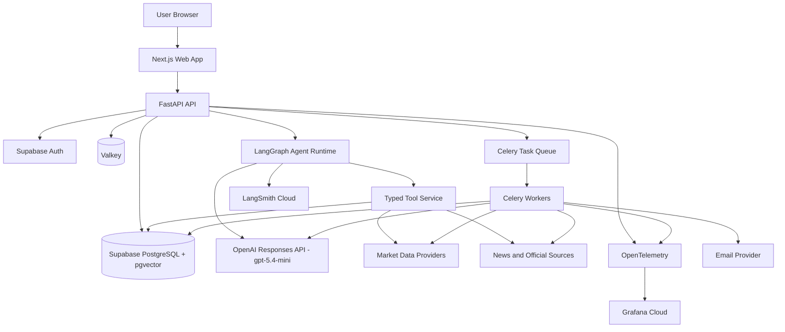

# Gold Market AI Agent - Technical Requirements Document

**Document ID:** GMAA-TRD-001  
**Version:** 1.4 Claude Code + Agent-Skills Enforced Baseline  
**Date:** 2026-08-05  
**Status:** Approved for implementation  
**Canonical format:** Markdown  
**Related document:** `Gold_Market_AI_Agent_PRD.md`  
**Supersedes:** Version 1.3 Agent-Skills Enforced Baseline dated 2026-08-05  

---

## Revision Summary

This revision retains the approved architecture and OpenAI `gpt-5.4-mini` runtime model strategy, selects Claude Code as the development environment, and keeps Addy Osmani's `addyosmani/agent-skills` workflow mandatory for technical implementation. Skill commands use the fully namespaced `/agent-skills:<skill-name>` form with pinned-version control and evidence-based completion gates. No data-provider, functional-scope, quota, security, or deployment principle is weakened.

## Approval Record

| Item | Decision | Approved baseline |
|---|---|---|
| UI/UX recommendations | Approved for implementation | Facts-first layout, progressive disclosure, safe trace, quota UX, degraded states, WCAG 2.2 AA, responsive P0 journeys |
| Application flow | Approved for implementation | Deterministic-first processing, asynchronous detailed analysis, deduplication, quota reservation, bounded repair, fallback, trace propagation |
| Runtime model | Approved | OpenAI `gpt-5.4-mini` through the Responses API for every runtime agent node |
| Development workflow | Approved | Claude Code with Addy Osmani `addyosmani/agent-skills`; actual skill workflows and their verification gates are mandatory |

Approval does not authorise personalised investment advice, guaranteed price direction, unlicensed data redistribution, hidden chain-of-thought exposure, or silent model escalation.

---

## Addy Osmani Agent-Skills Workflow Mandate (Normative)

In these controlled documents, **`agent-skills` means only the production engineering workflow pack published at `addyosmani/agent-skills`**. It does not mean AurumIQ's runtime LangGraph market-analysis agents, and it must not be replaced by a generic project-local skill summary.

Authoritative source and Claude Code integration:

- Repository: `https://github.com/addyosmani/agent-skills`
- Development environment: Claude Code CLI and its supported IDE integration
- Marketplace installation inside Claude Code:

  ```text
  /plugin marketplace add addyosmani/agent-skills
  /plugin install agent-skills@addy-agent-skills
  ```

- HTTPS fallback when GitHub SSH cloning is unavailable:

  ```text
  /plugin marketplace add https://github.com/addyosmani/agent-skills.git
  /plugin install agent-skills@addy-agent-skills
  ```

- Meta-skill invoked at the start of work: `/agent-skills:using-agent-skills`
- Task-specific skill invocation: `/agent-skills:<skill-name>`
- Lifecycle command wrappers, when used: `/agent-skills:spec`, `/agent-skills:plan`, `/agent-skills:build`, `/agent-skills:test`, `/agent-skills:review`, `/agent-skills:webperf`, `/agent-skills:code-simplify`, and `/agent-skills:ship`
- Skill definitions: the actual `skills/<skill-name>/SKILL.md` files installed from the authoritative repository

At repository bootstrap, the team must record the installed repository commit SHA in an `agent-skills.lock` file. Upgrades require human review, a documented change record, and revalidation of affected gates.

### Claude Code execution requirements

1. Start Claude Code from the AurumIQ repository root so the root `CLAUDE.md`, project settings, and repository context are applied consistently.
2. Keep the root `CLAUDE.md` concise. It must point Claude Code to these seven controlled documents, define their precedence, require the namespaced Addy Osmani skills, list approved build/test commands, and prohibit silent edits to controlled specifications. Do not copy Addy Osmani's repository-level `CLAUDE.md` or paste complete upstream `SKILL.md` bodies into the project `CLAUDE.md`.
3. Use fully namespaced commands such as `/agent-skills:using-agent-skills` and `/agent-skills:test-driven-development`. This prevents accidental use of similarly named Claude Code bundled skills or skills from another plugin.
4. After installation or upgrade, verify the plugin is enabled through `/plugin`, confirm the commands are visible through `/help`, invoke `/agent-skills:using-agent-skills`, and record the observed plugin version or commit SHA.
5. Claude Code may automatically select an applicable installed skill, but explicit invocation remains mandatory at controlled task boundaries and must be recorded as evidence.
6. Claude Code is the development assistant only. AurumIQ runtime agents continue to use OpenAI `gpt-5.4-mini` through the Responses API.

### Mandatory operating rules

1. Begin every implementation, design, migration, test, review, or release task by invoking `/agent-skills:using-agent-skills`.
2. Let the meta-skill route the task to the applicable Addy Osmani skill or skills. If a skill has even a plausible match, load and follow the actual `SKILL.md` workflow before proceeding.
3. Do not implement directly when an applicable skill exists. Complete its required specification, planning, verification, review, and exit gates.
4. Use `/agent-skills:git-workflow-and-versioning` for every code change and `/agent-skills:code-review-and-quality` before every merge.
5. Invoke `/agent-skills:debugging-and-error-recovery` immediately when tests, builds, migrations, runtime behaviour, or external integrations fail. Do not bypass or weaken a failing gate to continue.
6. Record evidence in the work item or pull request: task ID, installed agent-skills commit SHA, skills invoked, completed checkpoints, tests/commands run, results, unresolved risks, and approved exceptions.
7. A task is not complete when skill invocation or verification evidence is missing. Any exception requires explicit human approval and an ADR or controlled change record.

### Technical skill routing

| Technical activity | Mandatory Addy Osmani skills |
|---|---|
| Architecture or significant technical change | `/agent-skills:spec-driven-development`, `/agent-skills:planning-and-task-breakdown`, `/agent-skills:documentation-and-adrs` |
| Framework, SDK, database, provider, or cloud decision | `/agent-skills:source-driven-development`; add `/agent-skills:doubt-driven-development` for high-impact choices |
| REST, event, provider, model, tool, or module boundary | `/agent-skills:api-and-interface-design` |
| Authentication, RLS, secrets, external input, data storage, or trust boundary | `/agent-skills:security-and-hardening` |
| Database migration or compatibility change | `/agent-skills:incremental-implementation`, `/agent-skills:test-driven-development`, `/agent-skills:deprecation-and-migration` |
| Telemetry, production service, queue, worker, or provider integration | `/agent-skills:observability-and-instrumentation` |
| CI/CD or deployment automation | `/agent-skills:ci-cd-and-automation`; production release also requires `/agent-skills:shipping-and-launch` |

Technical implementation must use thin, testable slices through `/agent-skills:incremental-implementation` and `/agent-skills:test-driven-development`. A design statement in this TRD is not permission to skip the workflow encoded in the applicable skill.

---

## 1. Purpose

This document defines the target architecture, component responsibilities, data contracts, agent workflow, security controls, observability, testing strategy, deployment approach, and engineering standards for AurumIQ.

The design prioritises correctness and traceability over model autonomy, deterministic calculations, low-cost cloud deployment, modular replaceability, spec-driven development, and comprehensive verification.

---

## 2. Architecture Principles

1. Market facts come from tools and databases.
2. Financial calculations are deterministic.
3. The LLM interprets evidence but does not invent missing values.
4. Every material output is sourceable, timestamped, and validated.
5. Agents are logical workflow nodes, not separate services by default.
6. The MVP is a modular monolith with independently scalable workers.
7. External integrations use typed provider interfaces.
8. Model IDs and policy parameters are configuration, not business logic.
9. Security and observability are built in.
10. Specifications, tests, prompts, migrations, and ADRs are version controlled.
11. Addy Osmani `agent-skills` is the mandatory engineering workflow; the installed commit is pinned and evidenced per task.

---

## 3. Confirmed Technology Stack

| Layer | Technology | Decision |
|---|---|---|
| Frontend | Next.js App Router, TypeScript | Confirmed |
| UI styling | Tailwind CSS | Confirmed |
| Charts | Apache ECharts | Confirmed |
| Backend API | Python, FastAPI | Confirmed |
| Validation | Pydantic | Confirmed |
| ORM/migrations | SQLAlchemy, Alembic | Confirmed |
| Agent orchestration | LangGraph | Confirmed |
| Runtime LLM | OpenAI `gpt-5.4-mini` | Confirmed |
| LLM endpoint | OpenAI Responses API | Confirmed |
| OpenAI SDK | Official `openai` Python SDK | Confirmed |
| LangChain integration | `langchain-openai` | Confirmed |
| Embeddings | `text-embedding-3-small` initially, configurable | Recommended |
| Hosted database | Supabase PostgreSQL | Confirmed |
| Authentication | Supabase Auth | Confirmed |
| Vector search | pgvector | Confirmed |
| Cache/broker | Valkey | Confirmed |
| Background jobs | Celery and Celery Beat | Confirmed |
| AI observability | LangSmith Cloud | Confirmed |
| App observability | OpenTelemetry and Grafana Cloud | Confirmed |
| CI/CD | GitHub Actions | Confirmed |
| Development agent | Claude Code CLI and supported IDE integration with pinned Addy Osmani plugin | Confirmed |
| Test frameworks | Pytest, Vitest, Playwright, k6 or Locust | Confirmed |

### 3.1 Model policy

All runtime agent nodes use `gpt-5.4-mini`. Task policies vary by:

- reasoning effort;
- maximum output tokens;
- timeout;
- retry count;
- structured-output schema;
- tool allowlist;
- temperature or equivalent sampling configuration where supported;
- prompt version.

No automatic escalation to a larger model is permitted in the MVP. A future model-family change requires an ADR, offline evaluation, staging canary, cost review, and rollback plan.

### 3.2 Version policy

Pin exact dependency versions through lock files. Store model ID, model snapshot/alias, reasoning policy, prompt version, and SDK version in run metadata. Major upgrades require a regression run and ADR.

---

## 4. High-Level Architecture



---

## 5. Deployment Topology

### 5.1 Environments

- Local: synthetic fixtures and local tests.
- Test: isolated CI data.
- Staging: sanitised/demo data and canary evaluation.
- Production Demo: approved provider data.

### 5.2 Recommended hosting

- Frontend: Vercel.
- Backend/workers: Railway or comparable container host.
- Database/Auth: Supabase.
- Valkey: colocated container initially or managed compatible service.
- AI: OpenAI API.
- Agent observability: LangSmith.
- App observability: Grafana Cloud.

### 5.3 Processes

1. Next.js frontend.
2. FastAPI web process.
3. Celery worker.
4. Celery Beat scheduler.
5. Valkey if self-hosted.

Do not deploy each agent as a separate service in the MVP.

---

## 6. Repository Structure

```text
gold-market-ai-agent/
├── apps/
│   ├── web/
│   └── api/
│       ├── app/
│       │   ├── api/
│       │   ├── core/
│       │   ├── auth/
│       │   ├── agents/
│       │   ├── tools/
│       │   ├── providers/
│       │   ├── analytics/
│       │   ├── rag/
│       │   ├── repositories/
│       │   ├── schemas/
│       │   ├── services/
│       │   ├── tasks/
│       │   ├── llm/
│       │   │   ├── openai_client.py
│       │   │   ├── model_policy.py
│       │   │   ├── schemas.py
│       │   │   └── errors.py
│       │   ├── observability/
│       │   └── main.py
│       └── tests/
├── packages/contracts/
├── database/{migrations,seed,functions,policies}/
├── docs/{controlled,adr,runbooks,api}/
├── evals/{datasets,evaluators,reports}/
├── tests/{acceptance,smoke,e2e,performance,security}/
├── .github/workflows/
├── docker/
├── scripts/
├── agent-skills.lock
├── .env.example
├── compose.yaml
└── README.md
```

`agent-skills.lock` records the exact installed commit of `addyosmani/agent-skills`. The seven controlled documents under `docs/controlled/` define project intent and project-specific skill routing; the installed upstream `SKILL.md` files define the executable engineering workflows.

---

## 7. Backend Architecture

### 7.1 Layer boundaries

```text
API Routes
  -> Application Services
     -> Agent Runtime / Deterministic Analytics
        -> Typed Tools / Repositories / Provider Adapters
           -> PostgreSQL / Valkey / External APIs
```

Agent nodes never call market providers directly. They invoke typed tools. Calculations remain in deterministic analytics modules. API routes contain no business logic.

### 7.2 FastAPI modules

- `rates`
- `analysis`
- `alerts`
- `reports`
- `users`
- `usage`
- `admin`
- `health`

### 7.3 OpenAI client abstraction

```python
from typing import Any, Protocol, TypeVar
from pydantic import BaseModel

T = TypeVar("T", bound=BaseModel)

class LLMClient(Protocol):
    async def generate_structured(
        self,
        *,
        task: str,
        instructions: str,
        input_items: list[dict[str, Any]],
        output_schema: type[T],
        tools: list[dict[str, Any]] | None = None,
        trace_context: dict[str, str] | None = None,
    ) -> T: ...
```

The OpenAI implementation maps a task to a versioned `ModelPolicy` and calls the Responses API. Business services depend on the interface, not the SDK directly.

### 7.4 Model policy object

```python
from pydantic import BaseModel, Field

class ModelPolicy(BaseModel):
    model: str = "gpt-5.4-mini"
    reasoning_effort: str = "low"
    max_output_tokens: int = Field(gt=0)
    timeout_seconds: float = Field(gt=0)
    max_retries: int = Field(ge=0, le=2)
    prompt_version: str
    schema_version: str
```

Recommended policies:

| Task | Reasoning | Max output | Retry |
|---|---|---:|---:|
| Intent routing | Low | 500–800 | 1 |
| News extraction | Low | 800–1200 | 1 |
| Evidence synthesis | Medium | 2500–4000 | 1 |
| Validator/critic | Medium | 1200–2000 | 0–1 |
| Response composition | Low/Medium | 1800–3000 | 1 |

Exact supported fields are validated against the pinned SDK.

---

## 8. Frontend Architecture

Use Next.js App Router with Server Components for initial facts and Client Components for charts, forms, filters, and job status. Do not expose the OpenAI API key or call privileged model endpoints from the browser. All AI requests pass through FastAPI.

---

## 9. Authentication, Roles, and Quotas

Use Supabase Auth. Roles are `guest`, `registered_user`, `analyst`, and `administrator`. Enforce authorisation in FastAPI and RLS. Default fresh detailed-analysis quotas are 0 for guests, 5/day for registered users, configurable higher for analysts, and configurable internal limits for administrators.

Valkey provides atomic reservations; PostgreSQL records durable usage and audit history.

---

## 10. Data Model

Core entities include `profiles`, `market_sources`, `gold_quotes`, `daily_gold_rates`, `market_indicators`, `news_articles`, `market_events`, `analysis_reports`, `agent_runs`, `alerts`, `alert_deliveries`, `reports`, `usage_ledger`, and `configuration_versions`.

### 10.1 Model/run fields

`analysis_reports` must include:

```text
model_provider TEXT DEFAULT 'openai'
model_id TEXT
model_policy_id TEXT
reasoning_effort TEXT
prompt_version TEXT
schema_version TEXT
trace_id TEXT
input_snapshot_hash TEXT
validation_result JSONB
estimated_cost NUMERIC
```

`agent_runs` must include:

```text
provider TEXT
model_id TEXT
model_policy_id TEXT
response_id TEXT NULL
input_tokens INTEGER
output_tokens INTEGER
cached_tokens INTEGER
reasoning_tokens INTEGER NULL
estimated_cost NUMERIC
latency_ms INTEGER
status TEXT
failure_code TEXT NULL
```

Token fields are populated only when returned by the API. Unknown fields remain null rather than estimated as facts.

---

## 11. Provider Architecture

Each market provider implements authentication, timeout, retry, rate-limit handling, schema validation, normalisation, deduplication, legal/licence metadata, health checks, and contract tests. Source selection chooses the highest-priority valid source, records fallback usage, discloses material disagreement, and returns unavailable rather than inventing a value.

---

## 12. Ingestion and Background Processing

Recommended Celery queues:

- `market_data_high`
- `market_data_standard`
- `news_ingestion`
- `analysis_generation`
- `report_generation`
- `notifications`
- `maintenance`

Schedules remain configurable and idempotent. Persist a new quote only when the source payload/version or meaningful normalised value changes according to policy.

---

## 13. Deterministic Analytics Engine

Implement absolute/percentage change, period returns, moving averages, volatility, local/global normalisation, currency contribution indicators, provider discrepancy, data-age calculations, and quality scoring in Python/SQL with unit tests. The LLM does not perform authoritative arithmetic.

---

## 14. LangGraph Agent Architecture

### 14.1 State

```python
class AnalysisState(TypedDict):
    request: dict
    user_context: dict
    market_facts: dict
    historical_metrics: dict
    evidence: list[dict]
    chennai_context: dict
    hypotheses: list[dict]
    synthesis: dict | None
    validation: dict | None
    final_response: dict | None
    errors: list[dict]
    trace_context: dict
```

### 14.2 Nodes

1. Request validation and intent routing.
2. Market facts retrieval.
3. Historical analytics.
4. News/macro evidence retrieval.
5. Chennai pricing context.
6. OpenAI synthesis using `gpt-5.4-mini`.
7. Deterministic validator followed by model-assisted critic when needed.
8. Response composition.
9. Persistence and telemetry.

### 14.3 Tool-calling rules

- Tools are explicitly allowlisted per node.
- Tool inputs are schema validated.
- Retrieved content cannot redefine tool permissions.
- Side-effect tools require application-level authorisation.
- Agent loops have maximum-step and wall-clock limits.
- No recursive autonomous agent spawning in the MVP.

### 14.4 Structured output

Use versioned Pydantic/JSON schemas. Reject malformed output. Allow one repair call when safe and cost-effective. Persist both validation result and final accepted structured output.

### 14.5 Model-call envelope

Each call records:

- request/analysis/trace IDs;
- task and node name;
- model and policy IDs;
- prompt/schema versions;
- tool names offered and invoked;
- timeout and retry attempt;
- token usage and cost;
- response ID;
- validation result.

Do not persist hidden model reasoning.

---

## 15. RAG Architecture

Use pgvector for permitted content. Chunking and metadata are source-specific. Retrieval requires temporal filters, source trust, language, relevance, and licence status. The prompt wraps retrieved text as untrusted evidence. Citations reference canonical source records, not model-generated URLs.

---

## 16. API Design

Representative endpoints:

```text
GET  /v1/public/rates/current
GET  /v1/rates/history
GET  /v1/analysis/simple
POST /v1/analysis
GET  /v1/analysis/{analysis_id}
GET  /v1/analysis/{analysis_id}/status
POST /v1/alerts
GET  /v1/reports
GET  /v1/usage
GET  /v1/admin/models
POST /v1/admin/models/releases
GET  /v1/admin/traces/{trace_id}
```

`POST /v1/analysis` is idempotent by user parameters and market-state fingerprint. It returns an existing validated report or `202 Accepted` with an analysis ID.

---

## 17. Caching and Deduplication

Cache public rate summaries, historical queries, validated Simple Analysis, and completed detailed reports. Build a market-state fingerprint from canonical source snapshot IDs, comparison period, city, purity, and analysis policy version. Prompt/model version changes invalidate affected cached analysis.

---

## 18. Concurrency and Queue Limits

- At least 25 concurrent normal users.
- Maximum two to three concurrent OpenAI analysis tasks initially.
- Additional AI work is queued.
- Separate worker pools prevent model workload from blocking rate/history endpoints.
- Per-user/global rate limits apply.
- Budget circuit breaker may defer or reject new AI work.

---

## 19. Reports and Notifications

Daily reports reuse validated market snapshots and cached analysis where valid. PDF/CSV generation is server-side and sanitised. Alert evaluation is deterministic and never depends on an LLM. Delivery attempts are audited and retried according to policy.

---

## 20. Observability

### 20.1 Trace propagation

Propagate one trace context through Next.js, FastAPI, LangGraph, OpenAI Responses API, tools, providers, database, Valkey, Celery, and report/email delivery.

### 20.2 Metrics

```text
gold_api_requests_total
gold_api_request_duration_seconds
gold_provider_failures_total
gold_market_data_age_seconds
gold_fallback_usage_total
gold_llm_calls_total
gold_llm_tokens_total
gold_llm_cached_tokens_total
gold_llm_estimated_cost_total
gold_openai_rate_limit_total
gold_openai_timeout_total
gold_openai_schema_failure_total
gold_validation_runs_total
gold_answer_quality_score
gold_citation_coverage_ratio
gold_analysis_queue_depth
gold_alert_delivery_total
```

Avoid user IDs, raw prompts, and trace IDs as metric labels.

### 20.3 LangSmith

Capture graph nodes/edges, model and tool calls, prompt version, token usage, structured output, evaluations, and feedback with masking and sampling.

### 20.4 Logs

JSON logs include timestamp, environment, service, trace/span IDs, node/tool/provider, model policy, status, duration, error code, freshness, and fallback. Never log API keys, JWTs, passwords, full prompts by default, hidden reasoning, or sensitive content.

---

## 21. Security Design

- OpenAI keys are server-side secrets and scoped to a dedicated project.
- Separate API projects/keys for local, staging, and production where practical.
- Apply organisation/project spend limits and alerts.
- Validate all free-text input.
- Treat retrieved text as hostile.
- Use typed tool schemas and allowlists.
- Apply SSRF protections to any URL retrieval service.
- Redact secrets and personal data from traces.
- Verify webhook signatures if asynchronous provider callbacks are introduced.
- Maintain dependency, SAST, secret, container, and DAST scans in CI.

---

## 22. Failure Handling

### 22.1 OpenAI errors

Handle timeouts, connection failures, 429 rate limits, 5xx responses, invalid schemas, tool-loop exhaustion, and content refusal using typed error codes. Use bounded exponential backoff with jitter. Do not retry validation errors indefinitely.

### 22.2 Degraded response

When OpenAI is unavailable, return verified prices, deterministic comparisons, historical metrics, and a clearly labelled evidence list/limitation. Preserve or release quota according to whether billable work occurred.

### 22.3 Provider errors

Apply provider-specific retries, circuit breakers, fallback selection, quarantine, and stale-data disclosure.

---

## 23. Testing Strategy

### 23.1 Unit tests

Analytics, fingerprints, quota calculations, model-policy mapping, schema validation, provider normalisation, safety rules, and cost calculations.

### 23.2 Integration tests

OpenAI client mocked contract tests, database/RLS, Valkey atomic operations, Celery execution, provider adapters, LangGraph state transitions, and telemetry propagation.

### 23.3 Evaluation tests

Golden cases for price movement, conflicting evidence, stale data, source disagreement, event timing, prohibited advice, prompt injection, missing citations, and unsupported causality.

### 23.4 E2E and resilience

Guest rate view, login, analysis submission, job polling, report download, alert flow, quota race, OpenAI outage, provider outage, queue saturation, and rollback.

### 23.5 Release gate

A model/prompt policy cannot be promoted unless arithmetic accuracy, schema validity, citation coverage, unsupported-claim rate, safety language, latency, and projected cost meet approved thresholds.

---

## 24. CI/CD and AI-Assisted Development

Use GitHub Actions for lint, type checks, unit/integration tests, migrations, security scans, build, E2E smoke, and deployment gates.

Use Claude Code CLI or its supported IDE integration for controlled implementation. Install the authoritative Addy Osmani plugin inside Claude Code with `/plugin marketplace add addyosmani/agent-skills` followed by `/plugin install agent-skills@addy-agent-skills`. Record the installed commit SHA, launch Claude Code from the repository root, and invoke `/agent-skills:using-agent-skills` before every task. Claude Code must then invoke and follow every applicable namespaced `/agent-skills:<skill-name>` workflow. All changes must be reviewed, tested, scoped, and committed intentionally; Claude Code may not silently alter controlled specifications, rely on a similarly named bundled skill, or substitute a generic local skill summary.

---

## 25. Configuration

```text
OPENAI_API_KEY
OPENAI_PROJECT_ID
OPENAI_MODEL_ROUTER=gpt-5.4-mini
OPENAI_MODEL_EXTRACTOR=gpt-5.4-mini
OPENAI_MODEL_SYNTHESIS=gpt-5.4-mini
OPENAI_MODEL_VALIDATOR=gpt-5.4-mini
OPENAI_REASONING_ROUTER=low
OPENAI_REASONING_EXTRACTOR=low
OPENAI_REASONING_SYNTHESIS=medium
OPENAI_REASONING_VALIDATOR=medium
OPENAI_TIMEOUT_SECONDS=45
OPENAI_MAX_RETRIES=1
OPENAI_DAILY_BUDGET_INR
OPENAI_MONTHLY_BUDGET_INR
```

All values are validated at startup. Production refuses to start when required secrets are missing or unsafe defaults are detected.

---

## 26. Migration Checklist

- Remove Anthropic SDK and Claude LangChain packages.
- Add and pin official OpenAI SDK and `langchain-openai`.
- Replace provider client implementation behind `LLMClient`.
- Convert prompts to Responses API input/instruction structure.
- Define strict output schemas.
- Replace Claude model IDs in configuration, seed data, dashboards, fixtures, and tests.
- Rename Claude-specific metrics and UI labels to provider-neutral or OpenAI-specific names.
- Update outage, quota, trace, and acceptance wording.
- Confirm all development-workflow references select Claude Code plus the pinned Addy Osmani `addyosmani/agent-skills` plugin; verify `/plugin`, `/help`, `/agent-skills:using-agent-skills`, and task-specific namespaced skills are available.
- Run full golden evaluation and cost benchmark before approval.

---

## 27. Acceptance Gate

The revision is accepted when no active controlled document, configuration example, architecture diagram, test name, UI label, or runbook treats Anthropic Claude as the selected runtime model provider; Claude Code references are permitted only for development tooling; all runtime agents resolve to `gpt-5.4-mini`; deterministic features remain independent of the LLM; and the model migration passes quality, safety, latency, and budget evaluations.

## Approved Architecture Amendments Incorporated in This Baseline

1. Use a transactional outbox for domain-event publication; consumers are idempotent and delivery is at least once.
2. Use PostgreSQL as the quota source of truth and Valkey for fast locks/rate limits; quota reservation and finalisation are transactional.
3. Persist market observations as append-only time-series records with source, observation, market, and retrieval timestamps; avoid writes for unchanged provider values.
4. Detailed analysis uses a durable state machine and Celery task identity; API retries with the same idempotency key return the original request.
5. OpenAI calls use Structured Outputs for business schemas, bounded function/tool calling, task-specific model policies, and one controlled repair maximum.
6. Every external provider implements a typed provider contract, declared capabilities, legal/licence metadata, health checks, timeout/retry policy, and normalisation tests.
7. User-owned entities use Supabase Row Level Security; privileged service operations use narrowly scoped server credentials and audited paths.
8. Frontend status updates use polling initially, with server-sent events permitted behind the same status contract.
9. Model, prompt, schema, provider, and calculation versions are stored with completed analyses and reports.
10. Database, REST, event, and provider schemas are versioned controlled artifacts and must pass compatibility checks in CI.

## Normative Technical Artifacts

The controlled technical set is limited to the PRD, this TRD, UI/UX recommendation, application flow, backend database schema, API/event/provider contracts, and detailed implementation plan.

- Database entities, constraints, indexes, RLS, partitioning, retention, and migration rules: `Gold_Market_AI_Agent_Backend_Database_Schema.md`.
- REST endpoints, error envelopes, idempotency, domain events, provider interfaces, and model/tool contracts: `Gold_Market_AI_Agent_API_Event_Provider_Contracts.md`.
- Build order, work packages, skill routing, test gates, rollout, and definition of done: `Gold_Market_AI_Agent_Detailed_Implementation_Plan.md`.
- Engineering workflow authority: the pinned Addy Osmani `addyosmani/agent-skills` repository and the actual `SKILL.md` files selected through `/agent-skills:using-agent-skills`.

The implementation must not diverge from these artifacts without an approved migration, ADR, associated test updates, and completion of the applicable `agent-skills` workflow.
